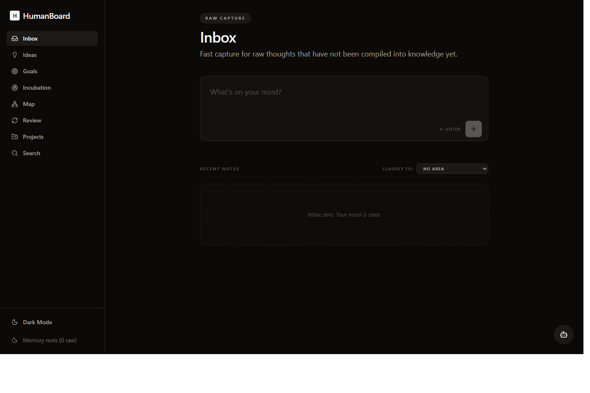
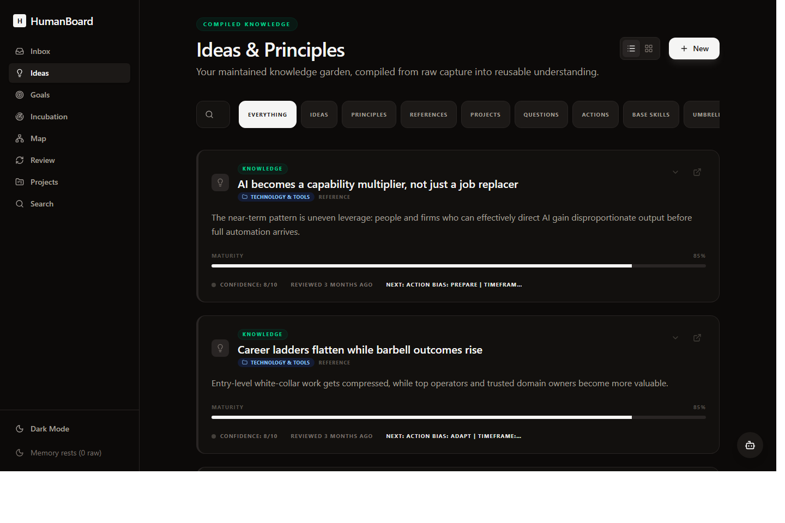
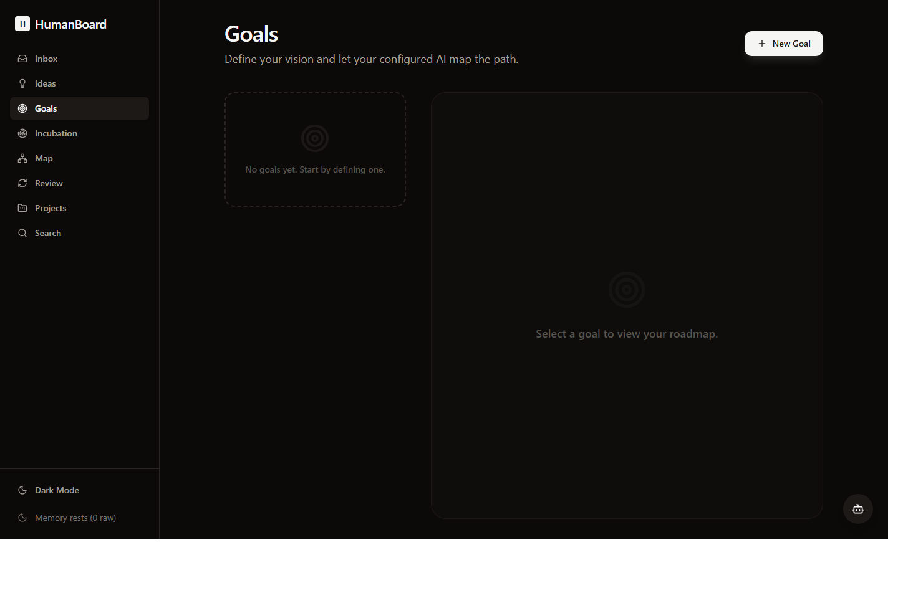

# HumanBoard

HumanBoard is a local-first workspace for capturing notes, shaping ideas, planning goals, mapping relationships, and running lightweight AI-assisted reflection workflows.

It is designed to work with any OpenAI-compatible local model server or hosted API the user prefers.

## Screenshots

### Inbox


### Ideas & Principles


### Goals


## Features

- Local-first snapshot-backed workspace
- Notes, ideas, goals, and knowledge review flows
- Relationship mapping and cross-linking
- AI-assisted refinement, roadmap generation, and reflection
- Tailscale-friendly self-hosting via the included production server
- MCP/server integration paths for automation

## AI runtime support

HumanBoard talks to an OpenAI-compatible chat completions API.
That can be:

- Ollama (with OpenAI compatibility)
- LM Studio local server
- vLLM or llama.cpp server
- OpenRouter
- Together
- your own OpenAI-compatible gateway

You choose the model and endpoint.

## Configure the model/API

Create `.env.local` and set:

```env
VITE_AI_BASE_URL=http://127.0.0.1:11434/v1
VITE_AI_MODEL=gemma4:26b
VITE_AI_API_KEY=***
```

Examples:

- Ollama: `http://127.0.0.1:11434/v1`
- OpenRouter: `https://openrouter.ai/api/v1`
- LM Studio: whatever local `/v1` endpoint you expose

## Local development

1. Install dependencies:

   `npm install`

2. Set your runtime in `.env.local`

3. Run the app:

   `npm run dev`

## Production server

Start the production build/server with:

`npm run build && npm run start:prod`

Or use the included helper scripts:

- `start-prod.ps1`
- `start-prod.cmd`

## API contract

HumanBoard uses an OpenAI-style chat completions request:

```json
{
  "model": "your-model-name",
  "temperature": 0.4,
  "messages": [
    { "role": "system", "content": "..." },
    { "role": "user", "content": "..." }
  ]
}
```

Target path:

- `${VITE_AI_BASE_URL}/chat/completions`

## Privacy

- Local snapshot/user data is not intended to be committed
- Snapshot files and local logs are ignored by `.gitignore`
- You can self-host entirely on your own machine or tailnet
